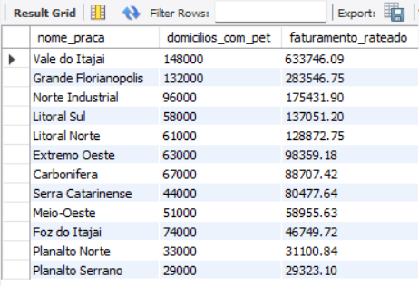
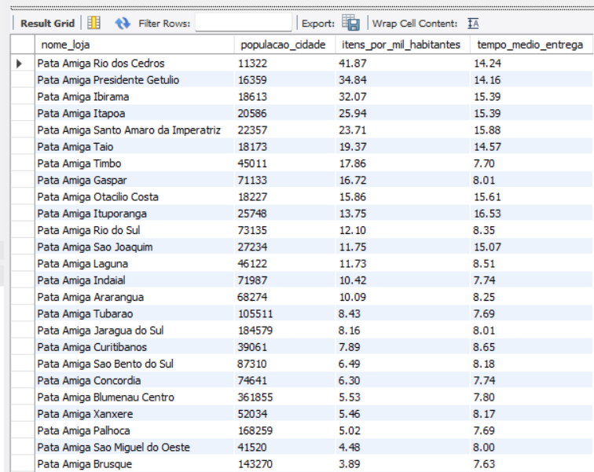
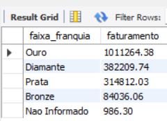
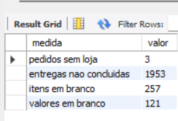

# Pata Amiga — Modelagem Dimensional (DW)

Projeto de modelagem dimensional para a rede de petshops **Pata Amiga** (Santa Catarina), construído em MySQL 8.0 a partir de três tabelas de staging com dados sujos, seguindo o roteiro da disciplina de Análise de Dados com Python/SQL.

## Como reproduzir o banco do zero

Rode os scripts na pasta `sql/`, **nesta ordem**, cada um até o fim antes de passar pro próximo:

1. `01-carga-staging.sql` — cria o banco `dw_pata_amiga` e carrega as três tabelas de staging (`stg_pedido`, `stg_loja`, `stg_loja_praca`) exatamente como vieram da origem.
2. `02-dimensoes-prontas.sql` — cria as tabelas do modelo (todas vazias) e já preenche `dim_tempo` e `dim_loja`.
3. `03-dimensoes.sql` — preenche `dim_categoria`, `dim_praca` e a tabela ponte `bridge_loja_praca`.
4. `04-fato.sql` — preenche `fato_pedido` a partir da staging, com um único `INSERT ... SELECT`.
5. `05-perguntas.sql` — as cinco consultas de negócio.

O arquivo `00-conferencia.sql` não faz parte da entrega: é uma ferramenta de apoio, rodada bloco a bloco após cada etapa, para conferir se os números batem com o esperado.

---

## Tarefa 1 — Diagnóstico da origem

Ao abrir as três tabelas de staging (`stg_pedido`, `stg_loja`, `stg_loja_praca`), encontrei os seguintes problemas de qualidade de dados:

**Grafias inconsistentes**
- `CategoriaProduto`: **18 grafias distintas** (considerando a collation do MySQL, que ignora acento e maiúscula/minúscula). Ex.: "Racao", "RACAO", "Ração", "RAÇÃO" e "Rac." representam a mesma categoria escritas de formas diferentes — por isso a Tarefa 3 monta uma `dim_categoria` para padronizar isso em 7 categorias.
- `Loja-Nome`: **128 grafias distintas**, incluindo variações de digitação, apelidos e abreviações da mesma loja, além do sufixo "/SC" e espaços duplos em alguns nomes.

**Dados faltantes**
- **1.575 pedidos (~39%)** vieram sem `Cod Loja` preenchido.
- **3 pedidos** vieram sem `Loja-Nome` — esses vão para a linha -1 ("Não Informado") da `dim_loja`.

**Marcos do processo em branco** (etapas do fluxo de entrega ainda não cumpridas na data de extração dos dados):
- `Dt Separacao Estoque`: **1.077** em branco
- `DtNotaFiscal`: **1.338** em branco
- `Dt_Despacho_Transportadora`: **1.665** em branco
- `DtEntregaCliente`: **1.953** em branco (quase metade dos pedidos ainda não foi entregue)

Esses marcos em branco indicam pedidos com o processo de entrega ainda em aberto — por isso, na Tarefa 4, essas ausências são gravadas como `NULL` (nunca como 0), preservando o significado de "etapa não cumprida".

---

## Tarefa 2 — Tratamento

_[a preencher: máscara de data escolhida e por quê, de-para das categorias, padronização do nome da loja]_

## Tarefa 3 — Construção das dimensões

_[a preencher: como `dim_categoria`, `dim_praca` e `bridge_loja_praca` foram montadas]_

## Tarefa 4 — Tabela fato

_[a preencher: decisões sobre `fato_pedido`]_

## Tarefa 5 — Respostas de negócio

### P1 — Onde está o gargalo do processo de entrega?

O intervalo mais lento em **todos** os portes de loja é entre a nota fiscal e o
despacho pela transportadora (`dias_nota_despacho`). Nas lojas de porte Médio
e Grande, esse intervalo dura em média **3,3 dias** — já nas lojas Pequenas,
dura **8,5 dias**, quase o triplo.

Esse gargalo puxa o tempo total do processo (do ERP até a entrega ao cliente)
para uma média de **15,2 dias** nas lojas Pequenas, contra **~7,9 dias** em
Médias e Grandes. O gargalo não está na etapa final de entrega em si
(`dias_despacho_entrega`, entre 2 e 2,9 dias em todos os portes) — está no
tempo entre faturar e despachar, e esse problema é especialmente grave nas
lojas menores.

### P2 — Qual categoria concentra o faturamento?

A categoria **Ração** concentra sozinha **60,01%** de todo o faturamento da
rede — de longe a categoria mais relevante do negócio. As demais categorias
somadas não chegam nem à metade disso: **Medicamento** vem em segundo lugar,
com 17,06%, e as outras cinco categorias (Petisco, Serviço, Higiene, Acessório
e Brinquedo) dividem os 22,93% restantes.

Não apareceu faturamento na categoria "Nao Informado" — ou seja, todos os
pedidos tiveram a categoria de produto identificada corretamente.

### P3 — O desconto funciona igual em todo canal?

O WhatsApp aparece corretamente na fato, com os 414 pedidos já confirmados na
carga — confirmando que a ordem do CASE (WHATS antes de APP) foi aplicada
certa.

Em **todos os canais**, o ticket médio dos pedidos **com** desconto é
consistentemente de 2,5 a 3 vezes maior do que o dos pedidos **sem**
desconto — o padrão se repete de forma muito parecida em App, Loja Física,
Site, Telefone e WhatsApp (todos na faixa de R$ 488 a R$ 514 com desconto,
contra R$ 167 a R$ 206 sem desconto). Ou seja, a política de desconto **funciona
de forma consistente entre os canais** — nenhum canal se destoa dos demais.

Vale uma ressalva: esse dado mostra uma **correlação**, não necessariamente
uma causa. Não dá pra afirmar que o desconto "faz" o cliente gastar mais — é
igualmente possível que pedidos maiores (que já tendem a ter ticket mais alto)
sejam justamente os que mais recebem desconto, por política comercial.

### P4 — Qual praça de atendimento concentra o faturamento?

**Vale do Itajaí** concentra o maior faturamento rateado da rede, com
**R$ 633.746,09** — mais que o dobro da segunda colocada (Grande Florianópolis,
R$ 283.546,75). E essa concentração não é só porque a praça é grande: cruzando
com o número de domicílios com pet, Vale do Itajaí fatura **R$ 4,28 por
domicílio**, quase o dobro da segunda melhor relação (Litoral Sul, R$ 2,36) —
ou seja, a praça performa acima do que seu tamanho de mercado sugeriria.

No outro extremo, **Foz do Itajaí** chama atenção pelo desempenho fraco: apesar
de ter 74.000 domicílios com pet (mais que Litoral Sul ou Litoral Norte), fatura
apenas R$ 46.749,72 — uma relação de **R$ 0,63 por domicílio**, a pior de toda
a rede. É a praça com maior espaço de mercado não capturado.

### P5 — Onde abrir a próxima loja, e o que os dados não permitem afirmar?

**(a) Ranking por itens vendidos por mil habitantes**

**Pata Amiga Rio dos Cedros** lidera o ranking com **41,87 itens por mil
habitantes** — uma demanda proporcionalmente muito maior que a média da rede,
apesar de ser uma cidade pequena (11.322 habitantes). O padrão se repete nas
posições seguintes: a maioria das lojas no topo do ranking (Presidente Getúlio,
Ibirama, Itapoa, Santo Amaro da Imperatriz) fica em cidades pequenas e médias,
e justamente essas lojas têm os **piores tempos de entrega** (14 a 16 dias) —
reforçando o achado da P1 de que lojas menores sofrem mais com o gargalo entre
nota fiscal e despacho.

A exceção interessante é **Timbó** (45.011 habitantes): tem alta demanda
relativa (17,86 itens/mil hab.) e o **melhor tempo de entrega da rede** (7,70
dias) — sugerindo que, quando a operação logística funciona bem, cidades
maiores conseguem crescer sem penalizar o cliente.

**(b) Faturamento por faixa de franquia**

Lojas na faixa **Ouro** concentram mais da metade do faturamento da rede.
Porém, esse número usa o cadastro **atual** da loja (`faixa_franquia` em
`dim_loja`), que é a foto de hoje. Como uma loja pode ter mudado de faixa ao
longo dos 7 meses analisados, esse valor **não** responde "quanto do
faturamento veio de pedidos feitos quando a loja já era Ouro" — ele soma todo
o histórico de pedidos da loja na faixa em que ela está *agora*, mesmo que
parte desses pedidos tenha ocorrido quando ela estava numa faixa inferior
(o cadastro de lojas não guarda histórico, só o estado presente).

**(c) O que ficou de fora**

- **3 pedidos** sem loja identificada (foram para a linha -1, não descartados)
- **1.953 entregas** ainda não concluídas na data de extração dos dados (quase
  metade da base — o tempo de entrega dessas é desconhecido, não zero)
- **257 pedidos** com quantidade de itens em branco
- **121 pedidos** com valor líquido em branco

**Recomendação final**

Cidades pequenas e médias (10 a 25 mil habitantes) mostram a maior demanda
reprimida por item vendido por habitante — são o perfil mais promissor para
uma próxima loja. Mas essa recomendação vem com uma condição: a rede precisa
resolver antes o gargalo logístico identificado na P1 (nota fiscal → despacho,
que chega a 8,5 dias em lojas Pequenas), sob risco de repetir nessa nova loja
os tempos de entrega de 14+ dias observados hoje nas cidades desse porte.

O que os dados **não permitem afirmar**: (1) se o faturamento por faixa de
franquia realmente reflete o desempenho de cada faixa ao longo do tempo, já
que o cadastro só tem a foto de hoje; (2) qual será o tempo real de entrega
das 1.953 entregas ainda em aberto — quase metade da base está incompleta
nesse quesito; e (3) uma relação de causa entre desconto e ticket médio (P3) —
apenas a correlação foi observada.

## Diagrama do modelo

_[a preencher: imagem do modelo estrela]_

## Vídeo

_[a preencher: link do vídeo no Google Drive]_
