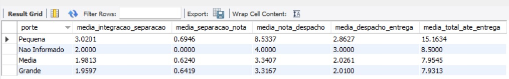
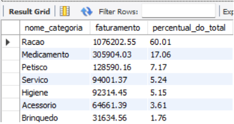
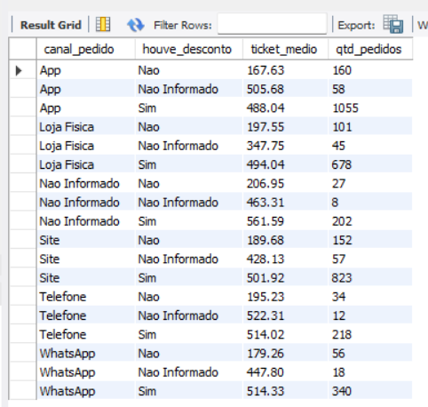

# Pata Amiga — Modelagem Dimensional (DW)

Projeto de modelagem dimensional para a rede de petshops **Pata Amiga** (Santa Catarina), construído em MySQL 8.0 a partir de três tabelas de staging com dados sujos, seguindo o roteiro da disciplina de Análise de Dados com Python/SQL.

## Como reproduzir o banco do zero

Rode os scripts na pasta `sql/`, **nesta ordem**, cada um até o fim antes de passar pro próximo:

1. `01-carga-staging.sql` — cria o banco `dw_pata_amiga` e carrega as três tabelas de staging (`stg_pedido`, `stg_loja`, `stg_loja_praca`) exatamente como vieram da origem.
2. `02-dimensoes-prontas.sql` — cria as tabelas do modelo (todas vazias) e já preenche `dim_tempo` e `dim_loja`.
3. `03-dimensoes.sql` — preenche `dim_categoria`, `dim_praca` e a tabela ponte `bridge_loja_praca`.
4. `04-fato.sql` — preenche `fato_pedido` a partir da staging, com um único `INSERT ... SELECT`.
5. `05-perguntas.sql` — as cinco consultas de negócio.

O arquivo `00-conferencia.sql` não faz parte da entrega: é uma ferramenta de apoio, rodada bloco a bloco após cada etapa, para conferir se os números batem com o esperado.

---

## Tarefa 1 — Diagnóstico da origem

Ao abrir as três tabelas de staging (`stg_pedido`, `stg_loja`, `stg_loja_praca`), encontrei os seguintes problemas de qualidade de dados:

**Grafias inconsistentes**
- `CategoriaProduto`: **18 grafias distintas** (considerando a collation do MySQL, que ignora acento e maiúscula/minúscula). Ex.: "Racao", "RACAO", "Ração", "RAÇÃO" e "Rac." representam a mesma categoria escritas de formas diferentes — por isso a Tarefa 3 monta uma `dim_categoria` para padronizar isso em 7 categorias.
- `Loja-Nome`: **128 grafias distintas**, incluindo variações de digitação, apelidos e abreviações da mesma loja, além do sufixo "/SC" e espaços duplos em alguns nomes.

**Dados faltantes**
- **1.575 pedidos (~39%)** vieram sem `Cod Loja` preenchido.
- **3 pedidos** vieram sem `Loja-Nome` — esses vão para a linha -1 ("Não Informado") da `dim_loja`.

**Marcos do processo em branco** (etapas do fluxo de entrega ainda não cumpridas na data de extração dos dados):
- `Dt Separacao Estoque`: **1.077** em branco
- `DtNotaFiscal`: **1.338** em branco
- `Dt_Despacho_Transportadora`: **1.665** em branco
- `DtEntregaCliente`: **1.953** em branco (quase metade dos pedidos ainda não foi entregue)

Esses marcos em branco indicam pedidos com o processo de entrega ainda em aberto — por isso, na Tarefa 4, essas ausências são gravadas como `NULL` (nunca como 0), preservando o significado de "etapa não cumprida".

---

## Tarefa 2 — Tratamento

_[a preencher: máscara de data escolhida e por quê, de-para das categorias, padronização do nome da loja]_

## Tarefa 3 — Construção das dimensões

_[a preencher: como `dim_categoria`, `dim_praca` e `bridge_loja_praca` foram montadas]_

## Tarefa 4 — Tabela fato

_[a preencher: decisões sobre `fato_pedido`]_

## Tarefa 5 — Respostas de negócio

### P1 — Onde está o gargalo do processo de entrega?

O intervalo mais lento em **todos** os portes de loja é entre a nota fiscal e o
despacho pela transportadora (`dias_nota_despacho`). Nas lojas de porte Médio
e Grande, esse intervalo dura em média **3,3 dias** — já nas lojas Pequenas,
dura **8,5 dias**, quase o triplo.

Esse gargalo puxa o tempo total do processo (do ERP até a entrega ao cliente)
para uma média de **15,2 dias** nas lojas Pequenas, contra **~7,9 dias** em
Médias e Grandes. O gargalo não está na etapa final de entrega em si
(`dias_despacho_entrega`, entre 2 e 2,9 dias em todos os portes) — está no
tempo entre faturar e despachar, e esse problema é especialmente grave nas
lojas menores.

### P2 — Qual categoria concentra o faturamento?

A categoria **Ração** concentra sozinha **60,01%** de todo o faturamento da
rede — de longe a categoria mais relevante do negócio. As demais categorias
somadas não chegam nem à metade disso: **Medicamento** vem em segundo lugar,
com 17,06%, e as outras cinco categorias (Petisco, Serviço, Higiene, Acessório
e Brinquedo) dividem os 22,93% restantes.

Não apareceu faturamento na categoria "Nao Informado" — ou seja, todos os
pedidos tiveram a categoria de produto identificada corretamente.

### P3 — O desconto funciona igual em todo canal?

O WhatsApp aparece corretamente na fato, com os 414 pedidos já confirmados na
carga — confirmando que a ordem do CASE (WHATS antes de APP) foi aplicada
certa.

Em **todos os canais**, o ticket médio dos pedidos **com** desconto é
consistentemente de 2,5 a 3 vezes maior do que o dos pedidos **sem**
desconto — o padrão se repete de forma muito parecida em App, Loja Física,
Site, Telefone e WhatsApp (todos na faixa de R$ 488 a R$ 514 com desconto,
contra R$ 167 a R$ 206 sem desconto). Ou seja, a política de desconto **funciona
de forma consistente entre os canais** — nenhum canal se destoa dos demais.

Vale uma ressalva: esse dado mostra uma **correlação**, não necessariamente
uma causa. Não dá pra afirmar que o desconto "faz" o cliente gastar mais — é
igualmente possível que pedidos maiores (que já tendem a ter ticket mais alto)
sejam justamente os que mais recebem desconto, por política comercial.

## Diagrama do modelo

_[a preencher: imagem do modelo estrela]_

## Vídeo

_[a preencher: link do vídeo no Google Drive]_
